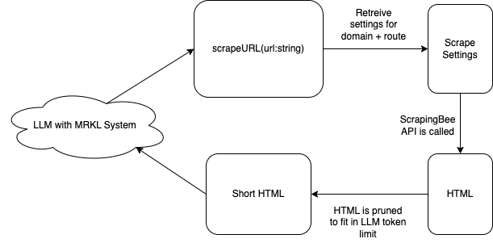
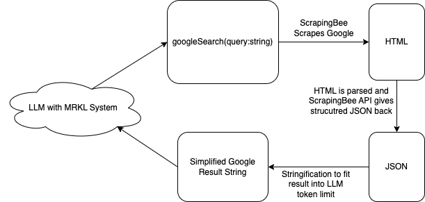
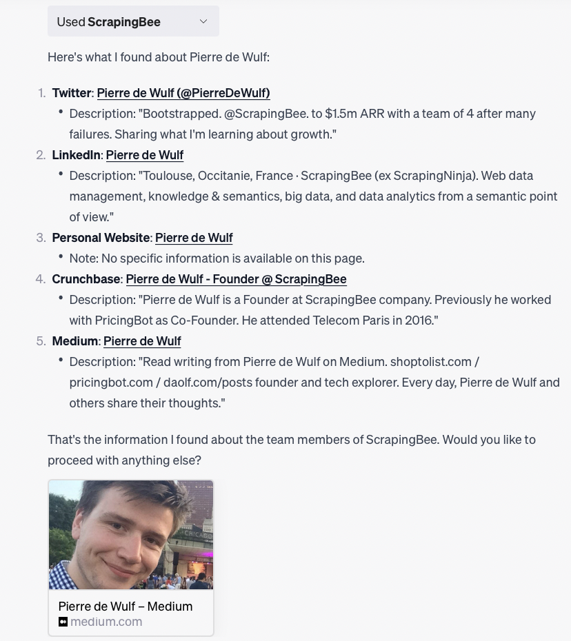

# Building a ChatGPT Plugin to Browse the Internet 🐝

Hi there. You must have landed on this page because you're interested in ChatGPT plugins and/or web scraping. Well, I have good news for you: I'm going to combine them! 😃 My name is [Jan](https://twitter.com/janwilmake), and one month ago I had the pleasure of joining ScrapingBee to create an internet-enabled AI plugin for them, powered by the ScrapingBee API.

Its results are quite cool 😃.

To see more about what you can do with this plugin, check out my [examples](scrapingbee-examples). Are you wondering how it works under the hood? Then keep reading, I'll show you...

## AI plugins: Where We Are Now

OpenAI released their [plugins system for ChatGPT](https://openai.com/blog/chatgpt-plugins) back in March. In the beginning it was only available for developers, but now all ChatGPT Plus users have access. In the future, once the plugin usability and quality is high enough, I won't be surprised if OpenAI opens up their store to the broader public.

I strongly believe AI plugins are here to stay as they allow developers to enhance the capabilities of Large Language Models like ChatGPT in an easy way. Without plugins, ChatGPT is already quite useful, but it can only answer questions about data it is trained on. Not only do AI plugins give LLM's like ChatGPT the capability to access external real-time data sources, they also allow ChatGPT to take actions in the real world for its users.

> AI plugins give LLMs the potential to become a new user interface for humans to use computers

At the time of writing there are over 800 plugins available in the plugin store. There are likely many more under development. Besides this, I'm sure there are many other AI companies working on similar plugin systems. If you make a plugin now, you might be able to later integrate it with dozens of other big LLM providers.

In this post, I'll show the process of making a plugin that allows ChatGPT to surf the web. The end result is the ScrapingBee GPT plugin that was released at the beginning of August

## ScrapingBee GPT

Let's first get an idea of what a plugin does. AI plugins implement a form of a [MRKL system](https://arxiv.org/abs/2205.00445) that allow a LLM to interact with functions. OpenAI later also came out with their [function calling API](https://openai.com/blog/function-calling-and-other-api-updates) which implements it in a more barebones way. ChatGPT plugins can be made by following a simple specification. If implemented correctly, you can enable your plugin in ChatGPT, which allows the LLM to use MRKL to opt to sometimes call your APIs. This will provide the Large Language Model with access to external data and actions.

Here is a simple schematic drawing of how the ScrapingBee plugin that I made works:

{{}}

The ScrapingBee plugin consists of two endpoints with clear descriptions: the url scraper allows the LLM to read website content, while the google searcher allows the LLM to search the internet when it doesn't have a URL yet.

**URL Scraper**

Besides simply scraping the URL and providing the HTML back, we also need to ensure the scraping API call is configured properly before sending it to ScrapingBee. Afterwards, we need to ensure that the result fits into the LLM token limit, which is currently maximum 16000 tokens for ChatGPT. For this, I basically removed the HTML tags that were irrelevant, as well as removing irrelevant properties on tags, among other things.

{{}}

**Google Search**

The Google Search endpoint is also using the internet, but this one is much more important to be done well as it is used a lot in the plugins logic. Therefore I've used the ScrapingBee Google Endpoint to scrape Google results in a structured way. Afterwards, I only needed to simplify the JSON into a short enough string so it fits in the LLM result.

{{}}

## The Specification

As you can also read in [OpenAI's excellent documentation](https://platform.openai.com/docs/plugins/introduction), to allow ChatGPT to use your API, you need to expose two additional endpoints: the `ai-plugin.json` file and your `openapi.json` spec.

The AI plugin JSON tells ChatGPT some metadata that is needed to show the plugin nicely in their plugin store. It also helps the AI understand what it can use your plugin for. This is how my `ai-plugin.json` for ScrapingBee GPT looks:

```json
{
  "auth": { "type": "none" },
  "api": {
    "type": "openapi",
    "url": "https://plugin.scrapingbee.com/openapi.json",
    "has_user_authentication": true
  },
  "schema_version": "v1",
  "contact_email": "contact@scrapingbee.com",
  "description_for_human": "Scrape any website with any prompt. If no url is given, query will be googled first",
  "description_for_model": "Scrape any website with any prompt. If no url is given, query will be googled first",
  "legal_info_url": "https://www.scrapingbee.com/terms-and-conditions/",
  "logo_url": "https://plugin.scrapingbee.com/logo.png",
  "name_for_human": "ScrapingBee",
  "name_for_model": "scrapingbee"
}
```

The [OpenAPI spec](https://swagger.io/specification/) creates a clear definition for the AI on how to use your plugin. This is how my `openapi.json` looks for ScrapingBee GPT:

```json
{
  "openapi": "3.1.0",
  "info": {
    "title": "ScrapingBee",
    "version": "v1",
    "description": "No description"
  },
  "servers": [
    {
      "url": "https://plugin.scrapingbee.com",
      "description": "Production server"
    }
  ],
  "paths": {
    "/function/flexibleScraper": {
      "post": {
        "summary": "Scrape any website with any prompt. If no url is given, query will be googled first",
        "operationId": "flexibleScraper",
        "requestBody": {
          "required": true,
          "content": {
            "application/json": {
              "schema": {
                "type": "object",
                "additionalProperties": false,
                "properties": {
                  "url": {
                    "type": "string",
                    "description": "Did the user specify a specific URL? If not, google will be used to find one"
                  },
                  "query": {
                    "type": "string",
                    "description": "What does the user want"
                  },
                  "queryType": {
                    "type": "string",
                    "enum": ["search", "images", "news", "places"],
                    "description": "Used if the user did not provide an URL"
                  }
                }
              }
            }
          }
        },
        "responses": {
          "200": {
            "description": "Standard response",
            "content": {
              "application/json": {
                "schema": {
                  "$ref": "#/components/schemas/StandardResponse"
                }
              }
            }
          }
        }
      }
    }
  },
  "components": {
    "schemas": {
      "StandardResponse": {
        "type": "object",
        "required": ["isSuccessful"],
        "properties": {
          "isSuccessful": {
            "type": "boolean"
          },
          "message": {
            "type": "string"
          },
          "priceCredit": {
            "type": "number"
          }
        }
      }
    }
  }
}
```

## Authentication and Rate limiting

Authentication for ChatGPT plugins can be done in a multitude of ways. The simplest way is the way that we have implemented above. As you can see there is no authentication at all.

If you have a plug-in that doesn't cost a lot of money to execute you can probably open it up to the public without authentication. However, OpenAI suggest that you implement simple app-level authentication. Besides, it is also possible to implement user level authentication, through an api-token, or by creating a oAuth login.

When developing a plug-in it is important to think about the monetisation. It is probably easiest to charge immediately for a plug-in but it might be harder for people to get on boarded. Therefore, just like with regular apps, it's probably a good idea to think about a freemium model where the plug-in is just a way to onboard users onto your platform at a later stage. Plug-ins are very easy to install so it's best to not make it too hard for the users immediately. Of course it really depends on your use case and your target audience. If, for example, your users already know you, it might be fine to onboard them with an API key. If you aim to onboard new users through the OpenAI plugin store, it's probably best to keep the onboarding as quick and easy as possible.

You can read more about AI plugin authentication [here](https://platform.openai.com/docs/plugins/authentication)

**Rate limits**

For ScrapingBee I chose to do no authentication at all. I later found that there is also a user ephemeral authentication header available when ChatGPT calls your API.

I think it could be an interesting way to prevent overuse by users because we can use this header to implement a rate limit at the user level, instead of on the app-level.

Rate limiting on the app-level may limit users because there might be a couple users that use your plugin a lot.

Ultimately a user-level rate limit is probably best, if you offer the plug-in for free. The ephemeral header allows you to bypass user authentication completely so the onboarding experience is super easy.

## (Re)generating an OpenAPI Specification

I've used [ts-json-schema-generator](https://github.com/vega/ts-json-schema-generator) to generate the open API specification automatically based on my types of functions and type interfaces.

I had to do quite some extra logic in order to get to an openapi spec, but this is the easiest way I found. I later also found other possibilities like [this one](https://github.com/bonukai/typescript-routes-to-openapi), which may also be a good choice. Along the same lines there are many other solutions available which may save you lots of valuable time in the long run.

## Review Process

The review process for open AI is relatively easy. [Their documentation](https://platform.openai.com/docs/plugins/review) is very clear on what is allowed and what is not allowed. After submitting and I got a response within a day I had to fix a couple of typos and after that my plug-in got approved within 24 hours. I have never seen such a fast review process!

## Trying it Out

ScrapingBee in ChatGPT allows you to use the internet, reducing the hallucinations or dead ends that a normal ChatGPT usually makes. Please note that you need to have ChatGPT Plus before you can use it.

To try it out, I've started with a simple prompt, getting a swift result:

{{}}

Now let's put it to the test with a bit more difficult task and let's see what it can do:

```
Look up more information about scrapingbee. find their website about page. find who is in the team. then, look up every team member individually at google. Do this step by step
```

The results were beyond my expectations!

{{}}
{{}}
{{}}

This really shows the plugin is capable of doing complex scraping tasks. Now it's time to discover what else it can do.

## Conclusion

In this blog post I have shown you how I made a plug-in that is able to access the Internet through natural language. I think the possibilities with web scraping in large language models are endless, and there are many more use cases that I can think of. What if, for example, you created a plug-in that allows you to do a company analysis for a list of companies? Or what if you did a plug-in that can analyse and compare different products? This could be quite useful and can all be built on top of a plugin like ScrapingBee GPT.

In a future post I plan to dive a bit deeper into different usecases of ScrapingBee GPT in the wild. Stay tuned!
