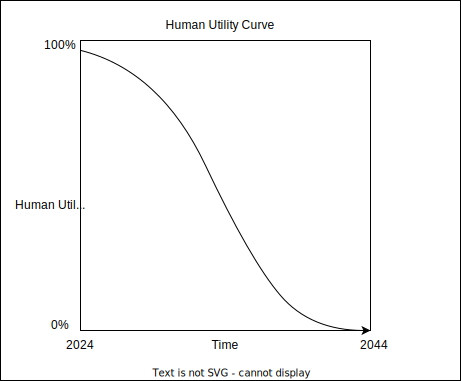

# Outcomputed

Electricity is becoming increasingly cheap, compute follows this trend as well, plus we're becoming better at making faster and more efficient compute in a exponential way.

Knowledge work is currently the biggest utlity that a regular human can have but computers are posing a thread to this utility. Human capacity is stagnant, and maybe even reduced a little in the last decades due to distractions and exposure to unhealthier food and technology.

GPT4o is reported to be smarter than highly educated knowledge workers (knowledge wise) and this trend is continuing. The % of tasks that computers can do will steadily go up over the coming years.

Depending on the type of work you do, maybe you're doing it all yourself still, you're collaborating with AI, or it's already completely useless and getting much harder to find work.

In any case, there will be a point in time at which you'll be outcompeted by machines: Outcomputed.

If the AI Capability trend continues as it does now, this is my prediction of how human utility will trend down. It's already started with certain niche professions, but as AI surpasses a certain treshold of general intelligence, things will move very fast for the largest segment of the population. People working on the cutting edge and flexible adoptors will stay relevant, most other people won't.

This is how I see it. How long it will really take, I can't say for sure, as it really depends on how much we embrace all of this, and how fast these new technologies will be shipped at scale. Regulation and transition is very important in this and is hard to predict.

How to stay ahead of the curve? How to stay relevant? **Dan Shipper** from Every.to says we can try to become [compute allocators](https://every.to/chain-of-thought/coding-with-devin-my-new-ai-programming-agent) and I think makes a lot of sense. In todays world, our intelligence is capped by our brainsize, but in the future, this isn't. Of course we can leverage more than only our intelligence. Social structures make it possible to leverage other humans to work for you in todays world. But in the future, this will become much more relevant as we cannot only leverage other humans but also machines.

How to become a compute allocator that matters? I think there are many ways. My bet is to build highly reliable agents, so I can enable this compute allocation to be highly effective in the real world - both for myself and for others.
