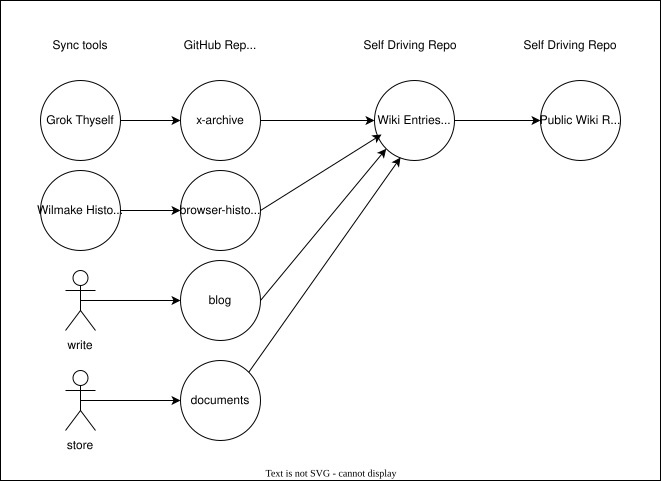

Lately, the LLM wiki idea from @karpathy has gotten a lot of attention. A lot of people are using OpenClaw or other local setups to create a LLM wiki. But I want something a bit more durable. I want to build a personal knowledge base (llm wiki) that evolves and grows usefulness for years on end. So naturally, I'd prefer to run this in the cloud, and not stop running when I turn off my laptop, not completely kill it when I get a new laptop. Current LLM wiki solutions are mostly a maintenance burden to the user: you need to ingest content into it and run agents on that or it stops evolving.

I've built several tools lately that make my llm wiki more durable and feasible:
