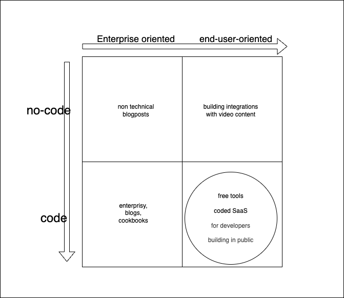

# 2025 in review, and plans for the coming year of DevRel

## 2025

In 2025, I've gained 2.5M X impressions across many smaller experiments and projects. Also in 2025, I've added +2600 new stars on GitHub across hundreds of new repos. And this is just the first year I'm truly embracing open source. Lots more to learn! In august 2025 I've started working with Parallel to set up a DevRel capacity. What I did:

- Crafted 5+ [cookbook recipes](https://github.com/parallel-web/parallel-cookbook)
- Published an [n8n integration](https://docs.parallel.ai/integrations/n8n)
- We've improved the Parallel MCP offering adding OAuth through the newly added [Parallel OAuth Provider](https://docs.parallel.ai/integrations/oauth-provider)
- I started with the [Task mcp](https://docs.parallel.ai/integrations/mcp/task-mcp), experimenting with [MCP UI](https://developers.openai.com/apps-sdk/concepts/ui-guidelines) and [Async Tasks](https://modelcontextprotocol.io/specification/2025-11-25/basic/utilities/tasks)
- Launched [LLMTEXT](https://parallel.ai/blog/LLMTEXT-for-llmstxt), a toolkit for the llms.txt standard.

The biggest challenge was finding what to work on that made sense for my audience. As a result, I couldn't sustain my X traffic and translate that to stars and impressions for Parallel. In 2026, I hope to overcome this challenge!

## Parallel DevRel 2026

The role I aim to fill in 2026 is the following - _Job: [Our first DevRel hire](https://jobs.ashbyhq.com/parallel/fa7448db-7464-47da-ad5f-11a78a87bb3b) - inspire those building with AI to get creative with the web. Be their biggest advocate within our team. You: Have built trust with a community. Love prototyping. Live on the bleeding edge of AI. You are a deep listener and obsess over customers._

I aim to take the following niche within DevRel. The no-code side of things still needs to be filled.

My niche:

- ~~nocode~~ <> **code**: Cloudflare & parallel
- ~~enterprisy~~ <> **Indie hackers / playful mindset**
- engaging more with active "build in public developers" about the projects. **community**: build SaaS in public, indie hackers, web scraping. Show them how to build a successful SaaS using Parallel's APIs

## Free Tools and DevTools

[Some of the cookbooks](https://github.com/parallel-web/parallel-cookbook) are also hosted and genuinely useful as free tools. [LLMTEXT](https://llmtext.com) also falls into the category of free tools. The strategy here is to build tools that bring genuine value to the developer community to then interest users of these free tools in the other products of parallel. The strategy overlaps greatly with that of [product-led growth](https://www.productled.org/foundations/what-is-product-led-growth)

- **[LLMTEXT](https://llmtext.com)**: tools promoting the llms.txt standard.
- **wilmake stack** skills library. Making making apps (with parallel when needed) easier.

## Build SaaS for the Agentic Internet

I want to build a business that operates on decentralised agent-friendly internet: build a real business that works purely within MCP and other Agent standards, not a website. This is still a highly experimental field because many standards haven't landed yet or are brand-new.

It's important to note I'm going to try to build a profitable business that is aimed to be independent from Parallel, then sell it. The reason for this, is I don't just want to build free tools, but I also want to learn and show people how I make real businesses that use Parallel primitives, to inspire others to do the same. 2026 is going to be amazing for this because the field of development is changing rapidly. New markets will be discovered.

Here are some ideas:

- **agent-friendly web**: Creating a literal "parallel web": the markdown browser; chat with any website.
- **[socialdatapod](https://github.com/janwilmake/socialdatapod)** / markdownfeed / clonechat: own your own social data and make it accessible cross-platform
- **uithub and forgithub**: [GitHub sucks](https://x.com/search?q=github%20sucks&src=typed_query); let's make an ecosystem together of tools replacing GitHub.
- **[task + cronjob](https://x.com/threepointone/status/2005265261235249496)** = agents
- **[oss jobs finder](https://ossjobs.wilmake.com)** - parallel tasks on trending OSS repos (view 10 for free, $69/month to see all 100s)
- Context marketplace! TBD.
