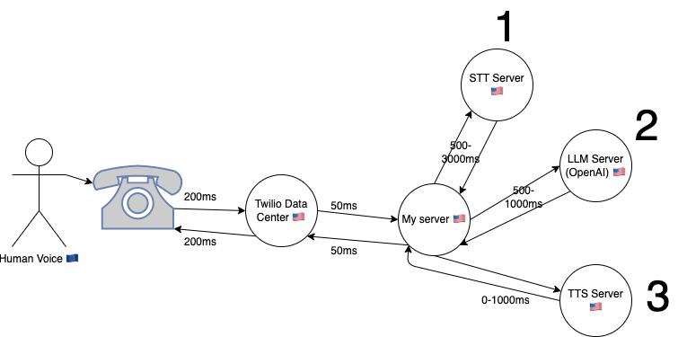

# Implementing LLM Voice Calls

An idea that has lingered in my head ever since ChatGPT came out was that of LLM voice calls. Imagine being able to simply call your AI from your Nokia 3310 and being able to ask it to do anything for you. As an active traveler that often goes to remote places for adventuring, I'd love such an interface with the highest intelligence of currenet society. It's not always possible to have a computer with a huge battery, or even an internet connection.

On a sunny sunday in the Netherlands, I decided to take a closer look to the possibility of this magical idea.

I've recently migrated my entire codebase to Bun.sh. For WhatsApp and SMS integration I have already used Twilio. Therefore, I quickly came to these two guides:

1. [Voice call streams](https://www.twilio.com/docs/voice/twiml/stream)
2. [Bun.sh WebSockets](https://bun.sh/docs/api/websockets)

But this is next level. Let's take a step back first. We need to first implement voice calls in the first place. After reading the twilio docs I came to these steps that I could take:

Step 1 is to initiate the call:

- [Make an outbound call](https://www.twilio.com/docs/voice/tutorials/how-to-make-outbound-phone-calls/node)
- [Respond to incoming call](https://www.twilio.com/docs/voice/tutorials/how-to-respond-to-incoming-phone-calls/node)

Step 2 is to have a conversation in realtime:

- [Stream the incoming audio](https://www.twilio.com/docs/voice/twiml/stream)
- [Play an audio file to the call](https://www.twilio.com/docs/voice/twiml/play)

Optionally, we can do more things like this:

- [Record the call](https://www.twilio.com/docs/voice/twiml/record)
- [Add another device into the call](https://www.twilio.com/docs/voice/twiml/dial)

A couple days ago I implemented a regular endpoint to receive a call (`receiveTwilioCallWithContextRaw`) and to send one (`sendPhoneCallMessage`). This is basically step 1. It works sufficiently well for one-time messages. I've integrated this into KingOS to make it possible to call anyone in your network with a phone call. The person that picks up will receive a generated voice that says a message. After that, the person can reply something and hang up the phone. The response is then sent to a webhook to process with Whisper, and the message is sent as audio + text back into the chat. I'm very happy with this simple implemenatation.

# Latency

I drew this graph to make it clearer where the voice is going before another voice returns to the same user. As you can see, the voice needs to first come from the phone of the other end all the way to the USA. It then goes through 3 stages:

1. **STT (Speech to Text)**: We can do this with either OpenAI's Whisper API, or maybe something like [Rev AI](https://www.rev.ai) or [DeepGram](https://deepgram.com) which is more performant for realtime transcription. Depending on this choice the speed may vary a lot.

2. **LLM (Large Language Model Transformation)**: We can use the OpenAI gpt-3.5-turbo streaming endpoint (chat completion). This gives us a first word within 250ms on average, and an entire sentence within 750ms most of the time.

3. **TTS (Text to Speech)**: For this we can use [play.ht](https://play.ht) for realtime voice generation. This is super high quality which is certainly the most fun. However, if we want to go for speed, we can also use local cli tools like `say` for macos and `espeak` for linux. This would reduce the time required by a second with ease (it's near-instant). The quality is a lot lower though.

Each of them has a latency, which is important to note. If you add everything together, we can expect to have **at least 1.5 seconds latency** before we get a response. Depending on our setup this may go up all the way to 5.5 seconds. Looking at this, I'm sure there's a big tradeoff between quality, cost, and speed.

Please note I've chosen to use API's here rather than doing everything on my own GPU(s). The reason for this is scalability. Since every server is in the US, I think every round-trip shouldn't add more than 100ms, so building our own in-house infra may reduce the total latency with another 300ms. This is next-level complex though to scale, so I don't think we should aim to solve this problem.

# High-level overview

We can either receive incoming calls or create outgoing calls and stream them. According to [Twilios guide](https://www.twilio.com/docs/voice/twiml/stream) you just need to provide the right TwiML XML to the response and it will start streaming when it's time. You can choose to stream it in two tracks or just stream one of them if you don't need the other. This allows you to differentiate who is who, which is great!

Today I'm going to try to make incoming calls stream. I already have a Dutch phone number that I am renting via Twilio, so I can easily make a call to it. The phone number sends incoming calls to my webhook at `/function/receiveTwilioCallWithContextRaw`.

What I want the behaviour of incoming calls to be:

1. Say 'Operator' (A way to state the AI is listening, inspired by the Matrix 😎)
2. Make sure it will start the stream and doesn't hang up.
3. Receive the stream in my websocket
4. Detect silences in the audiostream
5. Send this audio onwards to whisper after a silence is detected of at least a second.
6. Stream the transcription, with the right context, into a textual agent chatbot.
7. Every time we get a sentence back, ask PlayHT to generate an audio for this, and make Twilio play this audio via TwiML.

Rougly this can be cut up into two pieces:

- A) The operator picks up and sets up the audio stream
- B) Wrapper around a textual agent chatbot that makes it able to handle realtime audio

It is important to note that A is custom for twilio and websockets, while B is something more generic that could also potentially be re-used for calls over the internet or completely offline even, if implemented well.

Let's start with A!

# A) Operator, Setup the Stream

Let's set up everything in node.js with a temporary local server, similar to https://www.twilio.com/blog/live-transcribing-phone-calls-using-twilio-media-streams-and-google-speech-text

# B) Realtime Voice Wrapper

## 2. Transcribe Asap

- Save incoming audio to a wav in realtime (see https://stackoverflow.com/questions/58439005/is-there-any-way-to-save-mulaw-audio-stream-from-twilio-in-a-file)
- Test incoming audio (every 100ms) against node-vad until we detect silence.
- If there's a silence, send the speech to a realtime api to immediately to get the transcript back.
- If there's a new thing being said, interrupt message-processing and save all deltas as new conversation history

## 3. Reply

- use `processMessage({message, isStream:true, callback })`
- collect callback deltas until a sentence is formed. every sentence can be streamed to TTS (or can be done locally) https://docs.play.ht/docs/getting-started-with-playhts-realtime-streaming-api and https://docs.play.ht/reference/api-generate-tts-audio-stream
- the streamed audio can direclty be sent with ws.send (in the right format) to be queued and played
- interruption capability should stop sending if you interrupt

All in all, this would make for realtime

# Conclusion

It will probably take me some long evenings to reach this point. Hold tight!
